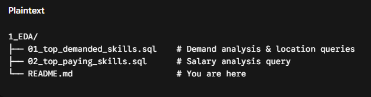

# Exploratory Data Analysis w/ SQL: Job Market Analytics  

A SQL project analyzing the data engineer job market using real world job posting data. It demonstrates my ability to **write production-quality analytical SQL, design efficient queries, and turn business questions into data-driven insights.**  

## 🧾 Executive Summary  

✅ **Project scope**: Built 2 analytical queries that answer key questions about the data engineer job market in Pakistan

✅ **Data modeling**: Used multi-table joins across fact and dimension tables to extract insights

✅ **Analytics**: Applied aggregations, filtering, grouping, and conditional metric limits to identify top skills by demand, salary potential, and top job locations

✅ **Outcomes**: Delivered actionable insights on core skill dominance (SQL/Python), cloud platforms, high-paying infrastructure tools (Docker/Databricks), and geographical hiring hubs in Pakistan  

**If you only have a minute, review these**:

[01_top_demanded_skills.sql](/1_EDA/01_top_demanded_skill.sql) – Demand analysis with multi-table joins and city-level job distribution

[02_top_paying_skills.sql](/1_EDA/02_top_paying_skill.sql) – Salary analysis with median calculations and frequency thresholds

## 🧩 Problem & Context  

Job market analysts need to answer questions like:

🎯 **Most in-demand**: Which skills are most in-demand for data engineers in Pakistan?

📍 **Top Hiring Hubs**: Which cities in Pakistan are offering the highest volume of Data Engineering roles?

💰 **Highest paid**: Which skills command the highest salaries in the local market?

This project analyzes a **data warehouse** built using a star schema design. The warehouse structure consists of:

**Fact Table**: `job_postings_fact` – Central table containing job posting details (job titles, locations, salaries, dates, countries, etc.)   

**Dimension Tables**:   

- `company_dim` – Company information linked to job postings   

- `skills_dim` – Skills catalog with skill names and types   

**Bridge Table**: `skills_job_dim` – Resolves the many-to-many relationship between job postings and skills   

By querying across these interconnected tables, I extracted insights about local skill demand, salary patterns, and primary geographical markets for data engineering roles in Pakistan.

## 🧰 Tech Stack

- 🐤 **Query Engine**: DuckDB / MotherDuck for fast OLAP-style analytical queries

- 🧮 **Language**: SQL (ANSI-style with analytical functions)

- 📊 **Data Model**: Star schema with fact + dimension + bridge tables

- 🛠️ **Development**: VS Code for SQL editing + Terminal for DuckDB CLI

- 📦 **Version Control**: Git/GitHub for versioned SQL scripts

## 📂 Repository Structure

## 🏗 Analysis Overview

### Query Structure

[Top Demanded Skills & Locations](/1_EDA/01_top_demanded_skill.sql) – Identifies the top 10 most in-demand skills for Data Engineer positions in Pakistan, as well as the top 10 geographic hiring hubs across the country.

[Top Paying Skills](/1_EDA/02_top_paying_skill.sql) – Analyzes the highest-paying skills required for Data Engineer positions in Pakistan (filtering for skills appearing in >100 postings) based on median salary.

### Key Insights
- 🧠 Core languages: SQL (1,061 postings) and Python (924 postings) lead skill demand by a wide margin in Pakistan.

- ☁️ Cloud platforms: AWS (657 postings) and Azure (570 postings) show strong demand, with Azure providing a solid balance of high demand and top-tier median compensation (PKR 123,000).

- 🐳 Premium Salary Drivers: Docker commands the highest median salary (PKR 180,000), while Databricks (PKR 147,500) offers an ideal balance of high compensation and high market demand.

- 📍 Hiring Hotspots: Lahore (335 postings) and Karachi (333 postings) are the primary hubs for Data Engineering in Pakistan, closely followed by Remote/Anywhere (236 postings) and Islamabad (216 postings).

## 💻 SQL Skills Demonstrated

### Query Design & Optimization

**Complex Joins**: Multi-table `INNER JOIN` operations linking `job_postings_fact`, `skills_job_dim`, and `skills_dim`.

**Aggregations**: `COUNT()`, `MEDIAN()`, and aggregate groupings to summarize market demand and pay scales.

**Filtering**: Explicit criteria via `WHERE` clause conditions (`job_country = 'Pakistan'` AND `job_title_short = 'Data Engineer'`).

**Thresholding**: Utilizing the `HAVING` clause (`COUNT(jpf.*) > 100`) to remove low-frequency outliers and highlight statistically meaningful salary metrics.

**Sorting & Ranking**: `ORDER BY` with `DESC` and `LIMIT` 10 clauses to deliver top-N ranking insights.